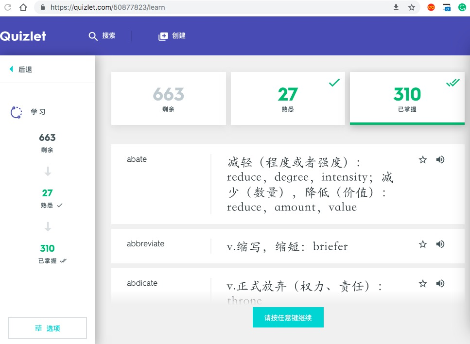

## Save mastered terms to csv

This workflow is to save the mastered terms into a csv file, so that customized review of them will be possible with tools like Excel.

It includes 4 Chrome DevTools source snippets, where `quizlet-download.js` is the main script.

New a snippet with the content of `quizlet-download.js`. Run the snippet upon the ***Mastered(已掌握)*** tab selected on the ***Learn*** page, which pops up every time you finish a round. A csv file with delimiter $ (the least possible character in an entry) should be downloaded to your Download directory. ***The entries are shuffled.***

Sorry for this novice-unfriendly workaround but expect a formal Chrome extension when I am free.

P.S. If your Excel isn't properly configured, import the data in a workbook rather than directly open it. On the import wizard, select $ as the delimiter and Unicode (UTF-8) as origin if necessary. Otherwise you may see messy code.

